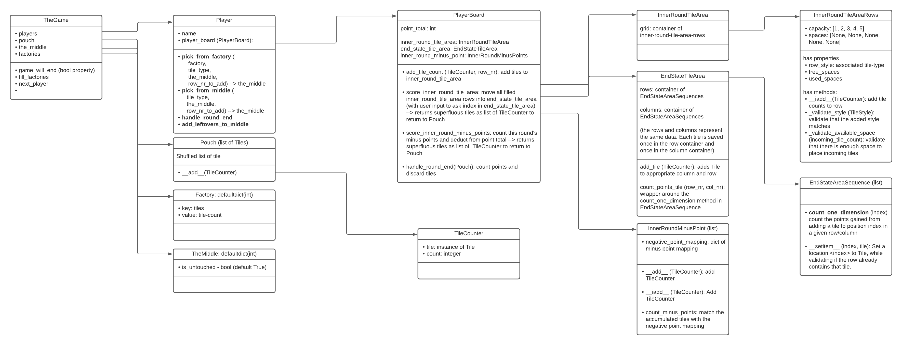

# Azul (work in progress)

When we bought it we were one player too many. Is it weird to volunteer for skipping the first games so you can program it instead?!

I did end up playing this game quite a bit and it's a fantastic game! The design of this game is just terrific. Also, the rules are not very complex, which makes it a fun programming project.

## Intended structure
I found this code I wrote a while ago. I never finished it and the general structure of the code is not great.

The intended structure of the classes is:
- Each `TheGame` has a number of `Player`s
- Each `Player` has a `Playerboard`
- Each `PlayerBoard` has
    - `InnerRoundTileArea`
    - `InnerRoundMinusPoints`
    - `EndStateTileArea`
    - current points
- Everybody has access to some shared resources, such as:
    - `Factory`
    - `Pouch` with `Tiles`
    - `TheMiddle`

The current state of the repo is depicted in this diagram 
