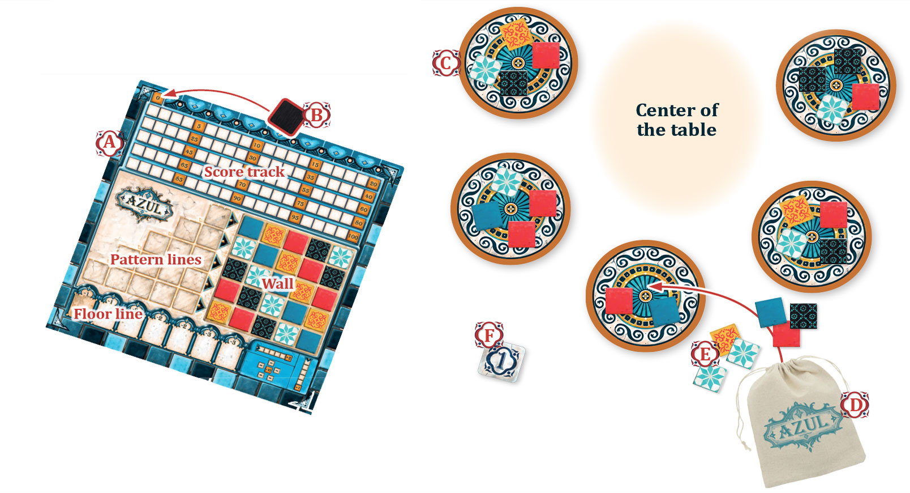
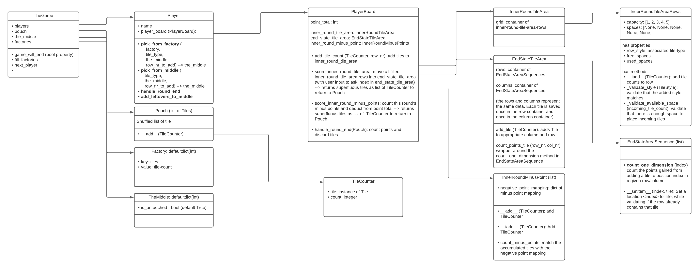

# Azul (work in progress)

I have been playing the original game quite a bit and it's a lot of fun! The design of this game is just terrific. Also, the rules are not very complex which makes it a fun programming project.

From [ultraboardgames.com](https://www.ultraboardgames.com/azul/game-rules.php):
> Introduced by the Moors, azulejos (originally white and blue ceramic tiles) were fully embraced by the Portuguese, when their king Manuel I, on a visit to the Alhambra palace in Southern Spain, was mesmerized by the stunning beauty of the Moorish decorative tiles.
> The king, awestruck by the interior beauty of the Alhambra, immediately ordered that his own palace in Portugal be decorated with similar wall tiles. Azul brings you, a tile laying artist, to embellish the walls of the Royal Palace of Evora.

## Game overview
The components in this repository represent the game setup:



- `A`: `PlayerBoard` has four areas: `ScoreTrack`, `PatternLines`, `Wall` and `FloorLine`
- `B`: `total_points` marker is also an attribute of the `PlayerBoard`
- `C`: `Factory` are filled up at the beginning of each round to contain four tiles
- `D`: `Pouch` contains 100 tiles of 5 different styles. It is used as the source of tiles. Discarded tiles
- `E`: `Tiles` are the objects that are moved from the pouch, to the factories, to the different parts of the player boards (and sometimes back into the pouch again). They come in 5 styles. There is also one tile, which is
- `F`: `X tile` or the `Tile(99)` is the starting player marker. 

For the rules of the game, I recommend you check out [ultraboardgames.com](https://www.ultraboardgames.com/azul/game-rules.php). Their explanation is clear and concise.

## Code overview
The code represents the game components. The further rules of the games govern how they interact with each other. That is perfect for an object oriented coding project!

Check out the relationship between the different components in this diagram: 

## How to play
This code does not come with a frontend. It is a pretty boring terminal game..

To play this game, clone the repo and run `python3 azul/play.py`

```bash
git clone git@github.com:KenHBS/games_collection.git
python3 azul/play.py
```
